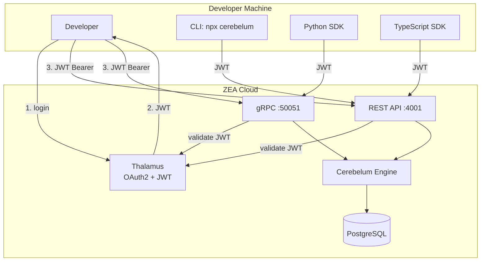
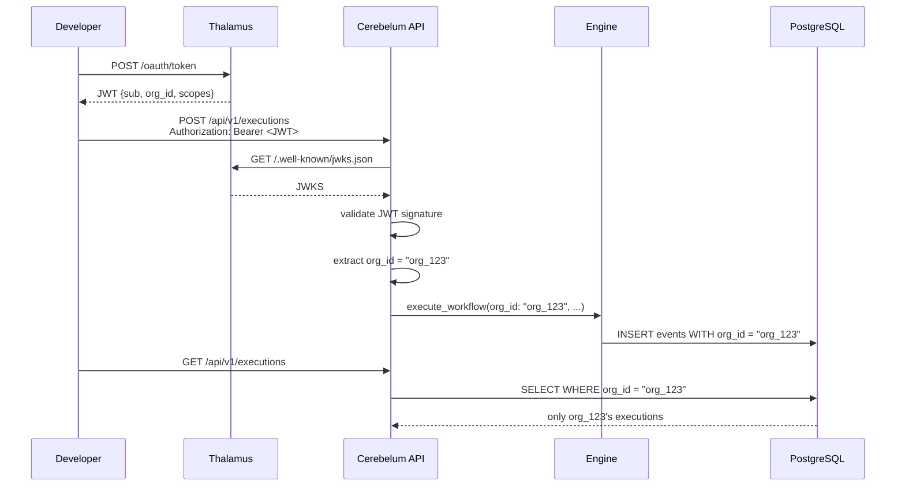
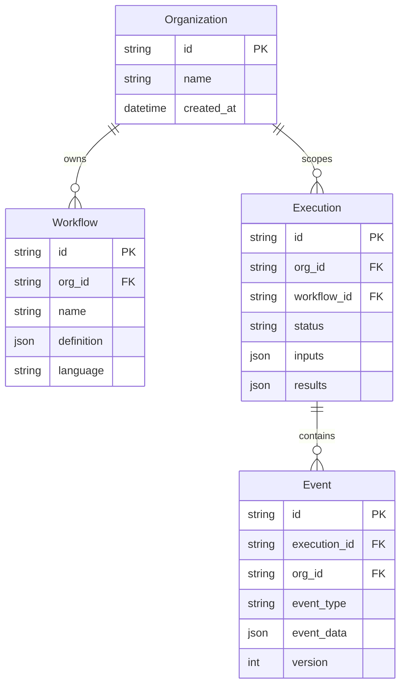

# Design — Cerebelum Cloud

## Overview
Cerebelum Cloud extiende el engine on-premise con: capa de auth (Thalamus JWT), multi-tenancy (organization_id), SDKs públicos, y deploy cloud. La arquitectura sigue el patrón Thalamus — un servicio Elixir/Phoenix con JWT auth, organizaciones como tenant boundary, y SDKs multi-lenguaje.

## Architecture



## Multi-Tenancy Flow



## Data Models



## Components

### 1. JWTAuth Plug (existente, adaptar)
- Ya existe `Cerebelum.API.Plugs.JWTAuth` (requiere `Req` para JWKS)
- Reemplazar `Req` con `Finch` o `Tesla` (ya están en deps)
- Validar firma JWT contra Thalamus JWKS
- Extraer `organization_id` y guardarlo en `conn.assigns`

### 2. Organization Scoping
- Agregar `organization_id` a Context, Data, Event schemas
- Migración: `ALTER TABLE events ADD COLUMN organization_id`
- Todos los queries agregan `WHERE organization_id = ^org_id`

### 3. SDK Publishing
- Python: `pyproject.toml` ya existe → `pip publish`
- TypeScript: `package.json` ya existe → `npm publish`
- Ambos auto-publican en CI/CD con GitHub Actions

### 4. CLI Installable
- El CLI TypeScript se publica como `@zea.cl/cerebelum-cli` en npm
- `npx @zea.cl/cerebelum-cli` o `npm i -g @zea.cl/cerebelum-cli`
- Soporta `CEREBELUM_URL` y `CEREBELUM_TOKEN` env vars

## Error Handling

```
401 Unauthorized → JWT inválido o expirado
403 Forbidden    → Organización no autorizada  
429 Too Many     → Rate limit excedido
503 Unavailable  → Database o gRPC caído
```

## Testing Strategy
1. **Unit**: JWTAuth plug, organization scoping queries
2. **Integration**: Engine con org_id, eventos scoped
3. **E2E**: SDK Python → gRPC con JWT → workflow completado
4. **Load**: Rate limiting con 1000+ req/min
