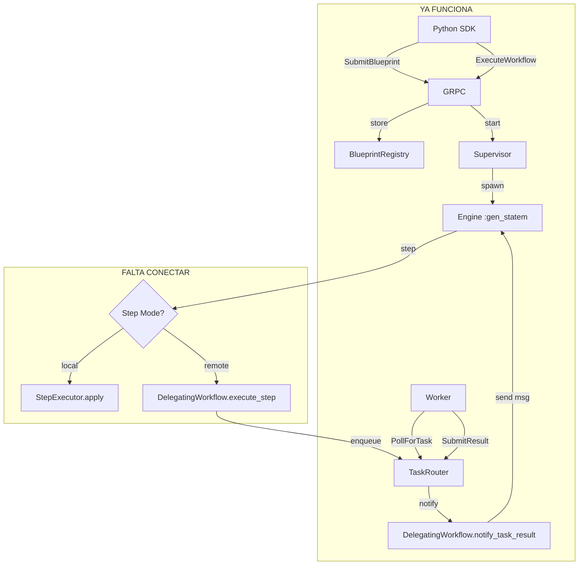

# Design — Python Distributed Workflow Execution

## Overview
El diseño ya existe y está parcialmente implementado. `DelegatingWorkflow` es el bridge entre Engine y Workers. Solo falta el último paso: integrarlo en `StateHandlers.executing_step`.

## Architecture



## Lo que YA existe

```
✅ BlueprintRegistry — guarda blueprints validados
✅ WorkerRegistry — registra workers Python
✅ TaskRouter — cola de tasks + dispatch  
✅ WorkerServiceServer.execute_workflow — arranca el Engine con DelegatingWorkflow
✅ WorkerServiceServer.submit_result — notifica a DelegatingWorkflow
✅ DelegatingWorkflow.execute_step — crea task, espera callback
✅ DelegatingWorkflow.notify_task_result — recibe resultado del worker
✅ DelegatingWorkflow.await_task_result — bloquea esperando respuesta
✅ Engine.sleeping — estado para sleep de workers
```

## Lo que FALTA

```
❌ StateHandlers.executing_step no sabe delegar a DelegatingWorkflow
❌ StepExecutor no detecta modo remoto vs local
❌ DelegatingWorkflow no lee blueprint del contexto (usa context.metadata)
❌ Engine no tiene estado waiting_for_worker (usa el timeout de 5min de gen_statem)
```

## Cambios necesarios

### 1. StepExecutor — detectar modo
```elixir
defp step_mode(data) do
  if data.context.workflow_module == Cerebelum.WorkflowDelegatingWorkflow do
    :remote
  else
    :local  
  end
end
```

### 2. StateHandlers.executing_step — delegar
```elixir
def executing_step(:internal, :execute, data) do
  case StepExecutor.step_mode(data) do
    :remote ->
      result = DelegatingWorkflow.execute_step(data.context, step_name, args)
      handle_step_result(data, step_name, result)
    :local ->
      # ... existing code
  end
end
```

### 3. DelegatingWorkflow — corregir lectura de blueprint
```elixir
# Antes (mal):
workflow_module = Map.get(context, :workflow_module, "unknown")

# Después (bien):
# El blueprint viene en opts del Engine, no en context
```

### 4. Engine.init — pasar blueprint a estado
Ya se pasa como `blueprint:` en opts. Solo hay que leerlo en DelegatingWorkflow desde el data del Engine, no desde el Context.
