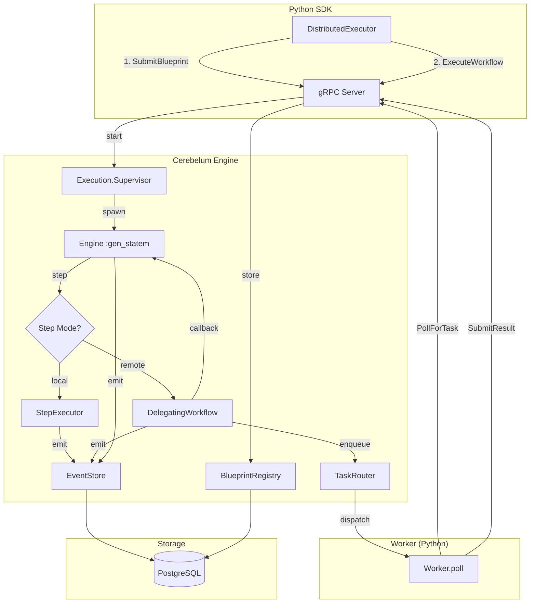
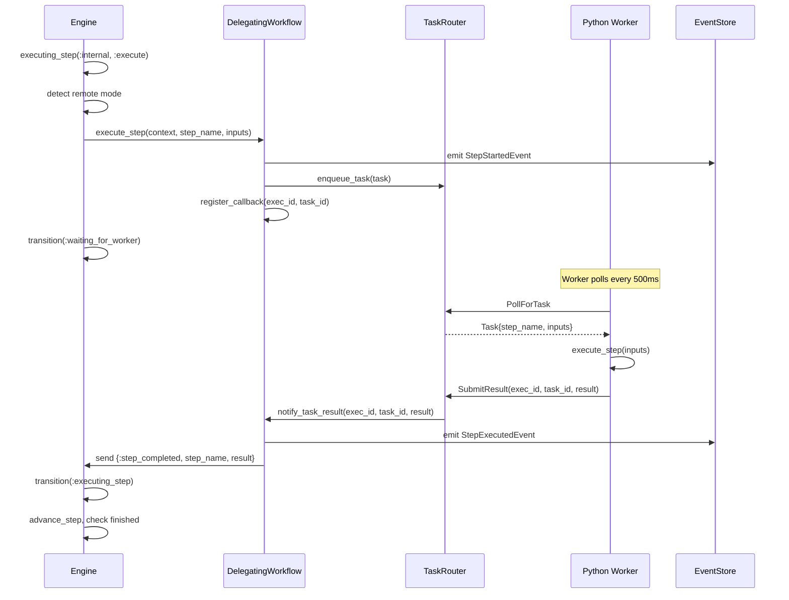
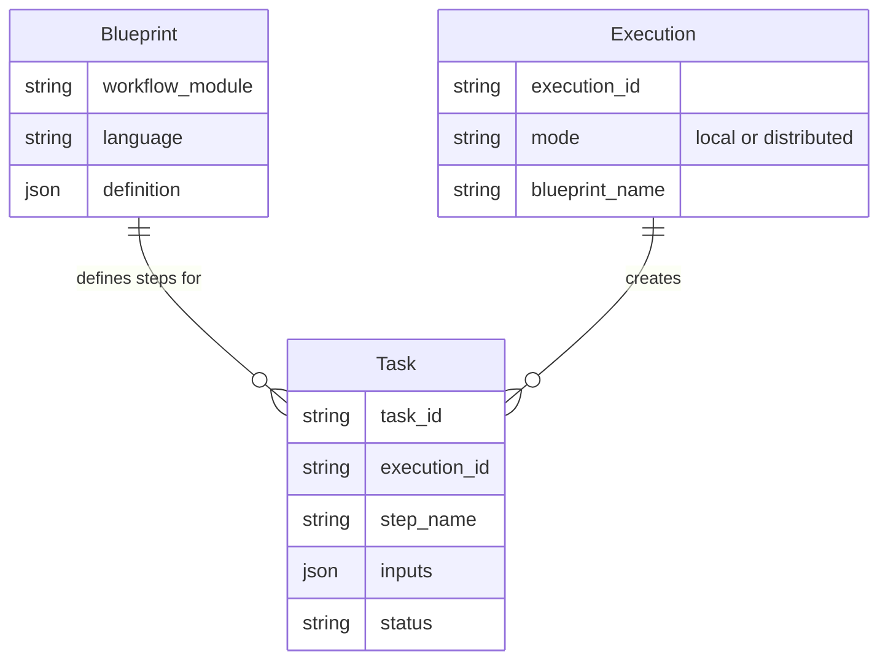

# Design — Python Distributed Workflow Execution

## Overview
Extender el Execution Engine para soportar dos modos de ejecución de steps: **local** (Elixir) y **remoto** (Python via worker). Usar el patrón Strategy en `StepExecutor` para despachar al modo correcto según el tipo de workflow. La comunicación Engine ↔ Worker es async vía `TaskRouter` con callbacks.

## Architecture



## Components and Interfaces

### 1. Step Mode Detection (`StepExecutor` extension)
- **Responsibility**: Determinar si un step se ejecuta local o remoto
- **Input**: `workflow_module`, `blueprint` context key
- **Output**: atom `:local` | `:remote`
- **Logic**: Si `workflow_module == Cerebelum.WorkflowDelegatingWorkflow` Y existe `:blueprint` en opts → `:remote`

### 2. DelegatingWorkflow (existente, a completar)
- **Responsibility**: Crear tasks en TaskRouter y esperar resultados
- **Input**: `context`, `step_name`, `step_inputs`
- **Output**: `{:ok, result}` | `{:error, reason}`
- **Cambios necesarios**:
  - Leer `blueprint` del contexto (no de `context.metadata`)
  - Leer `blueprint_name` para identificar el workflow
  - Registrar callback para `notify_task_result`
  - Timeout de 5 minutos por step

### 3. TaskRouter (existente, funcional)
- **Responsibility**: Cola de tasks FIFO por worker type
- **Sin cambios**: Ya implementa enqueue/dequeue/poll

### 4. WorkerServiceServer (gRPC — existente)
- **Responsibility**: Endpoints gRPC para workers
- **Sin cambios**: `PollForTask`, `SubmitResult`, `Register` funcionan

## Data Flow — Execute Step



## Data Models



## Error Handling

```
Step fails:
  1. Worker returns {:error, reason}
  2. TaskRouter → DelegatingWorkflow.notify_task_result
  3. DelegatingWorkflow → Engine: {:step_failed, reason}
  4. Engine → StateHandlers: evaluate diverge rules
  5. Match → jump/retry. No match → mark failed

Worker timeout:
  1. TaskRouter detecta 5min sin respuesta
  2. Reintenta hasta 3 veces
  3. Fallo final → DLQ + ExecutionFailedEvent

Worker desconectado:
  1. WorkerRegistry.remove(worker_id)
  2. Tasks pendientes → reencolar para otros workers
```

## Testing Strategy
1. **Unit**: `StepExecutor` mode detection, `DelegatingWorkflow` task creation
2. **Integration**: Engine + TaskRouter + Mock Worker (sin gRPC real)
3. **E2E**: Python SDK → gRPC → Engine → Worker Python real → resultado
4. **Regression**: Workflows Elixir nativos no afectados por los cambios
